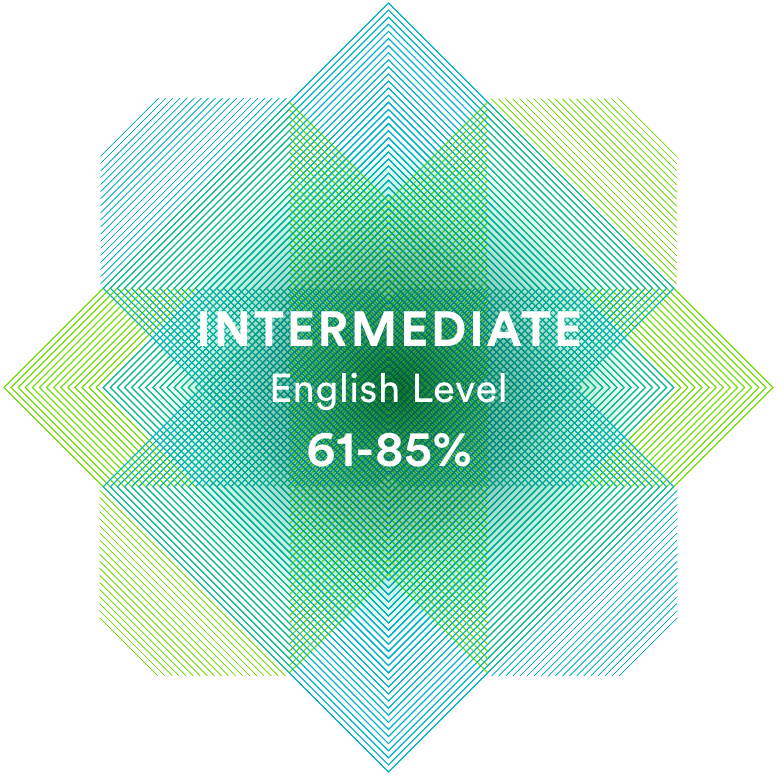

# **Olga Pachko**
## **Contacts**
-  __Location:__ Minsk, Belarus
-  __Phone:__ +375 33 640-75-16
-  __Email:__ olgapachko07@mail.ru
-  __GitHub:__ Olga27pn


## **About Me**
 I have good interpersonal skills, am an excellent team worker and very willing to learn and develop new skills. 

 I believe, that my ability to learn and to gain new skills will lead me through this path of becoming a proficient Frontend Developer.


## **Skills**
-  HTML
-  CSS/SASS
-  JavaScript (Basic)
-  Git


## **Code Example**
```
function multiply(a, b){
  return a * b}
```

## **Experience**

## **Education**
- **University:** Polessky State University (economist)
- **Courses:**
    - Code-basics Course "HTML"
    - Stepik Course "Generation Python": a course for beginners"
    - RS Schools Course "JavaScript/Front-end. Stage 0" (in progress)

## **Languages**
- Russian - Native
- English - Intermediate/Upper-intermediate (according to the online test [www.efset.org](https://www.efset.org/quick-check/))

